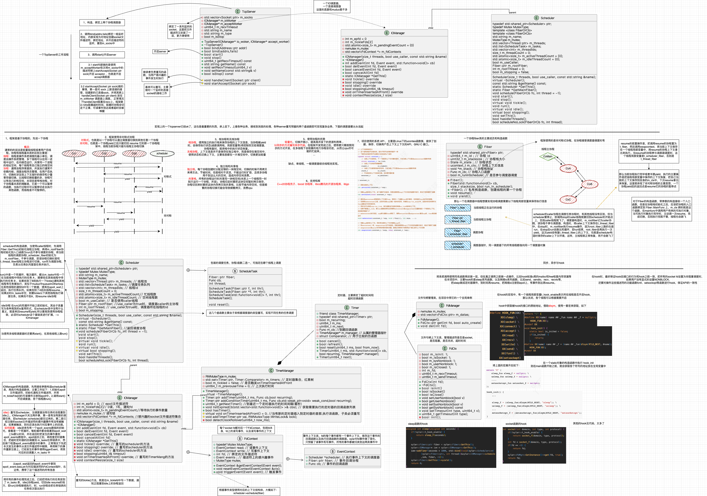

# sylar-from-suycx

直接参考：

[C++高性能分布式服务器框架](https://github.com/sylar-yin/sylar)

[从零开始重写sylar C++高性能分布式服务器框架](https://github.com/zhongluqiang/sylar-from-scratch)

## 概述

[整体介绍](docs/README.md)

[协程模块介绍](docs/suycx/README.md)

## 编译&&使用

### 编译

依赖：`yaml-cpp` `protobuf` `zookeeper`

```shell
# 装一些工具
sudo apt-get update
sudo apt-get install -y build-essential autoconf automake libtool curl git unzip

# 源码安装，最好放到一个之后可以随时查看的地方
git clone https://github.com/jbeder/yaml-cpp.git
cd yaml-cpp
mkdir build
cd build
cmake ..
make -j4
make install

# protobuf安装 本项目的根目录下的tools-packages里放的有3.12.4源码包，最好放到一个之后可以随时查看的地方
sudo unzip protobuf-3.12.4.zip
cd protobuf-3.12.4
./autogen.sh
./configure
make -j4
sudo make install
sudo ldconfig
# 检查安装是否成功
protoc --version

# zookeeper编译安装c开发包
tar -zxvf zookeeper-3.4.10.tar.gz
cd zookeeper-3.4.10
cd src/c
./configure
# 修改一下makefile
sudo vim Makefile
# 这一行注释掉AM_CFLAGS = -Wall -Werror，保存退出
make -j4
sudo make install 
```

编译本项目：

```shell
git clone https://github.com/SuycxZMZ/sylar-from-suycx.git
cd sylar-from-suycx
mkdir build
cd build
cmake ..
make -j4
# 头文件会安装到 /usr/local/include/sylar 文件夹
# 编译生成的动态库安装到 /usr/local/lib 文件夹
sudo make install 
```

### 使用

头文件引入示例：

```C++
    // 基本组件头文件引入 
    #include "sylar/sylar.h"
    //附加应用组件 
    #include "sylar/rpc/..."
```

编译的时候链接库 (protobuf pthread yaml-cpp zookeeper_mt sylar), 如果不想连接这么多，直接改成编译静态库就行了

## 资料

- [sylar和muduo的一些总结](https://zakuv5r1g02.feishu.cn/wiki/NTbawzte0iyYnrkYfyMc8PmwnlP?from=from_copylink)，批判性的看就行，这是我秋招刚开始时写的，后面没有再改
- 根据项目总结的一张图，用的`drawio`，[链接](docs/diagrams/allclass.drawio)，大图如下



## 说明

- rpc长连接待优化
  - 目前这个版本是对mprpc的基本复现
  - 如果要改长连接，provider端不用改太多，caller端的代码可能要再写一份实现，原本项目中的 channel 中每次rpc调用都会重新分配一个socket进行连接-->发送-->接收，长连接的话应该重新写一份channel的实现，记录对端地址、在zookeeper上注册watcher等
  - 这个目前在分布式KV中参考原项目改了一个简单版的长连接rpc。但是不能作为通用型。后续优化价值不大，成熟的项目直接用`gRPC`吧

- 最新的代码在[gitee](https://gitee.com/suycx/sylar-from-suycx)
